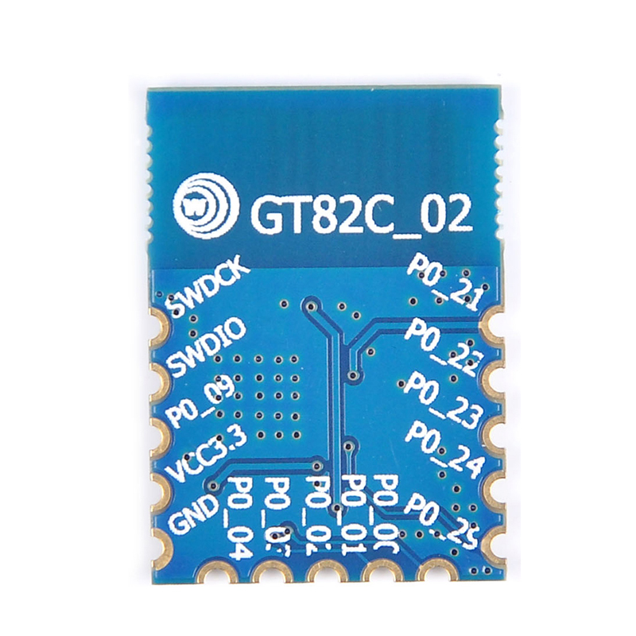

# NRF51422-SoC

## Context

I am using NRF51422 BLE SoC coupled with different sensors in my house automation to monitor temperature / humidity / door status (open / close).

## Programming the NRF51422 SoC

I am using MBed (A free open source IoT OS and developpement tools from Arm) to compile the C++ source code.

I am using the [nRF51 DK](https://www.nordicsemi.com/Products/Development-hardware/nrf51-dk) BLE Development board to flash the NRF51422 chips.

## Datasheet

NRF51422 Datasheet : <https://www.nordicsemi.com/products/nrf51422>

### GT82C02 Chip (based on NRF51422 SoC)

Pinout

Programming using nRF51 DK developpement board
 
VTG pin of the nRF51 DK should be connected to VDD

Chip => NRF51 DK mapping

VCC => VDD
GND => GND
SWDCK (Serial Wire Debug Data Clock) => SDWCK
SWDIO (Serial Wire Debug Data Input/Output => SWDIO

