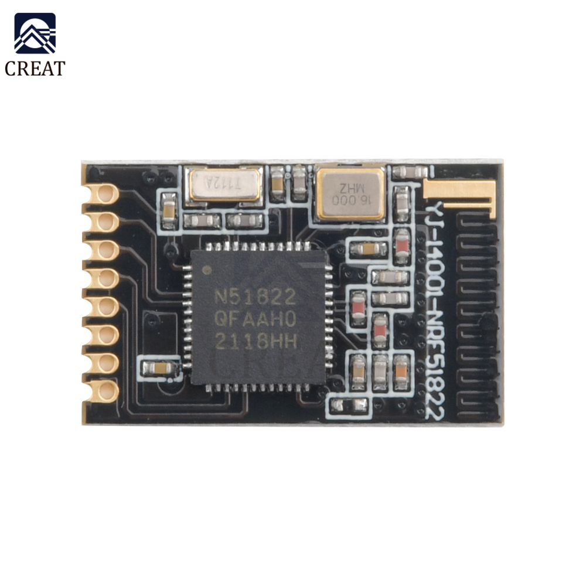
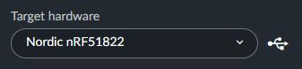

# NRF51422-SoC

## Context

I am using NRF51422 BLE SoC coupled with different sensors in my house automation to monitor temperature / humidity / door status (open / close).

## Programming the NRF51422 SoC

I am using [Keil Studio](https://studio.keil.arm.com/) (A free open source IoT OS and developpement tools from Arm) to compile the C++ source code.

I am using the [nRF51 DK](https://www.nordicsemi.com/Products/Development-hardware/nrf51-dk) BLE Development board to flash the NRF51422 chips.

## Nordic BLE Development Hardware

See : <https://infocenter.nordicsemi.com/index.jsp?topic=%2Fstruct_nrf52%2Fstruct%2Fnrf52832_ps.html>
See : <https://www.nordicsemi.com/Products/Bluetooth-Low-Energy/Development-hardware>

nRF5340-DK : See <https://www.nordicsemi.com/Products/Development-hardware/nRF5340-DK>
nRF52840-DK : See <https://www.nordicsemi.com/Products/Development-hardware/nRF52840-DK>

## Datasheet

NRF51422 Datasheet : <https://www.nordicsemi.com/products/nrf51422>

## Programming the NRF51422 on the NRF51-DK developpement board

See pinout : <https://os.mbed.com/platforms/Nordic-nRF51-DK/>

You need to choose the Nordic nRF51-DK target harware on Keil Studio.
So you can have the correct pin name

## Programming YJ-14001-NRF51822 (based on NRF51822 SoC) with the NRF51-DK Dev Board



PinOut (from up to down)

VDD
P00_0
P00_1
P00_9
P00_11
SWD
SCLK
GND

Careful, in order to program this chip you need to select this target : Nordic nRF51822 in Keil Studio (So you have the correct target RAM size set, otherwise it will not work properly)



Indeed, our chip has only got 16Ko of RAM whereas nRF51-DK seems to have a nRF51822 or nRF51422 chip that has 32Ko of RAM (Specification says both version exists : <https://infocenter.nordicsemi.com/index.jsp?topic=%2Fstruct_nrf52%2Fstruct%2Fnrf52832_ps.html>)

See <https://os.mbed.com/questions/79101/will-the-nrf51822-ever-compile-again-usi/>

Moreover, you cannot use MBed version greatest than 2 (as it use more that 16Ko of RAM).
__So MBed 2 must be used__

Here is how things should be connected:

nRF51-DK with nRF51-DK
----------------------

* VDD <-> VTG (mandatory otherwise it will be the nRF51822 chip on the nRF51-DK that will be programmed)
* GND <-> GND

nRF51-DK with nRF51822
----------------------

* GND <-> GND
* VDD <-> VDD (around 2.8v)
* SWD IO <-> SWD IO
* SWD CLK <-> SCLK

If you want to make some serial debug, you can plug a USB Serial converter (then use MobaXTerm for instance to connect to Serial COM)

nRF51822 with Serial Converter
------------------------------

* P0_09 (you choose the pin you want for TX) <-> RX
* GND <-> GND

## Programming YJ-14001-NRF51822 (based on NRF51822 SoC) with a Raspberry and OpenOCD

I made a RaspiOS image with my ARM Paker stuff
I installed OpenOCD with my AWX Ansible stuff


Raspberry 4 with nRF51822
-------------------------

* GND (Pin Header 6) <-> GND
* VCC 3.3v (Pin Header 1) <-> VDD
* GPIO 11 (Pin Header 23) <-> SCLK
* GPIO 25 (Pin Header 22) <-> SWD IO

nRF51822 with Serial Converter
------------------------------

* P0_09 (you choose the pin you want for TX) <-> RX
* GND <-> GND

Open one terminal and type:

```bash 
sudo openocd -f /usr/local/share/openocd/scripts/interface/raspberrypi4-native.cfg  -c "transport select swd; set WORKAREASIZE 0" -f target/nrf51.cfg
```

You shall see this:

```bash
Open On-Chip Debugger 0.12.0+dev-00040-gcda39f929 (2023-01-21-14:34)
Licensed under GNU GPL v2
For bug reports, read
        http://openocd.org/doc/doxygen/bugs.html
0
Info : Listening on port 6666 for tcl connections
Info : Listening on port 4444 for telnet connections
Info : BCM2835 GPIO JTAG/SWD bitbang driver
Info : clock speed 1000 kHz
Info : SWD DPIDR 0x0bb11477
Info : [nrf51.cpu] Cortex-M0 r0p0 processor detected
Info : [nrf51.cpu] target has 4 breakpoints, 2 watchpoints
Info : starting gdb server for nrf51.cpu on 3333
Info : Listening on port 3333 for gdb connections
```

Open a second terminal and type:

```bash
telnet 127.0.0.1 4444
halt
nrf51 mass_erase
flash write_image erase /applications/hex/test_rpi4.hex 0
reset
```

You shall see this :

```bash
fred@openocd:/applications/hex $ telnet 127.0.0.1 4444
Trying 127.0.0.1...
Connected to 127.0.0.1.
Escape character is '^]'.
Open On-Chip Debugger
> halt                                                     
[nrf51.cpu] halted due to debug-request, current mode: Thread 
xPSR: 0x21000000 pc: 0x0001c3c6 msp: 0x20003fd4
> nrf51 mass_erase
nRF51822-QFAA(build code: H1) 256kB Flash, 16kB RAM
Mass erase completed.
A reset or power cycle is required if the flash was protected before.
> flash write_image erase /applications/hex/test_rpi4.hex 0
Flash write discontinued at 0x000007c0, next section at 0x00001000
Adding extra erase range, 0x000007c0 .. 0x000007ff
not enough working area available(requested 34)
no working area available, falling back to slow memory writes
Flash write discontinued at 0x0001b4d8, next section at 0x0001c000
Adding extra erase range, 0x0001b4d8 .. 0x0001b7ff
not enough working area available(requested 34)
no working area available, falling back to slow memory writes
Adding extra erase range, 0x00020a04 .. 0x00020bff
not enough working area available(requested 34)
no working area available, falling back to slow memory writes
auto erase enabled
wrote 128668 bytes from file /applications/hex/test_rpi4.hex in 10.453257s (12.020 KiB/s)

> reset
```

## References

* [Eric Tsai Best project](https://www.hackster.io/erictsai/lora-tooth-small-ble-sensors-over-wifi-lora-gateways-0aa109)
* [ARDUINO NANO 33 BLE SENSE - Review with nRF52840](https://community.element14.com/products/roadtest/rv/roadtest_reviews/963/arduino_nano_33_ble_1)
* [Eric Tsai project code](https://os.mbed.com/users/electronichamsters/)
* [Connecting-raspberry-pi-4-to-nrf51822-bluetooth-chip-using-openocd](https://sysadmin-central.com/2020/12/05/connecting-raspberry-pi-4-to-nrf51822-bluetooth-chip-using-openocd/)
